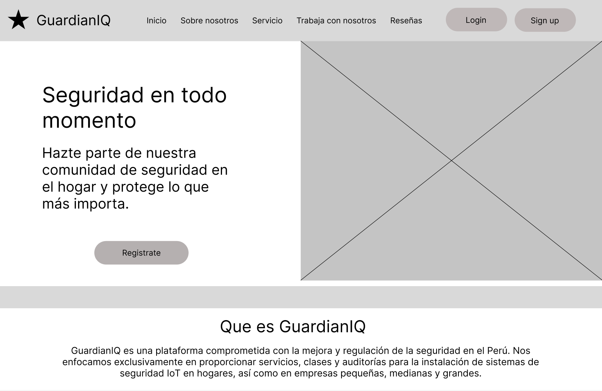
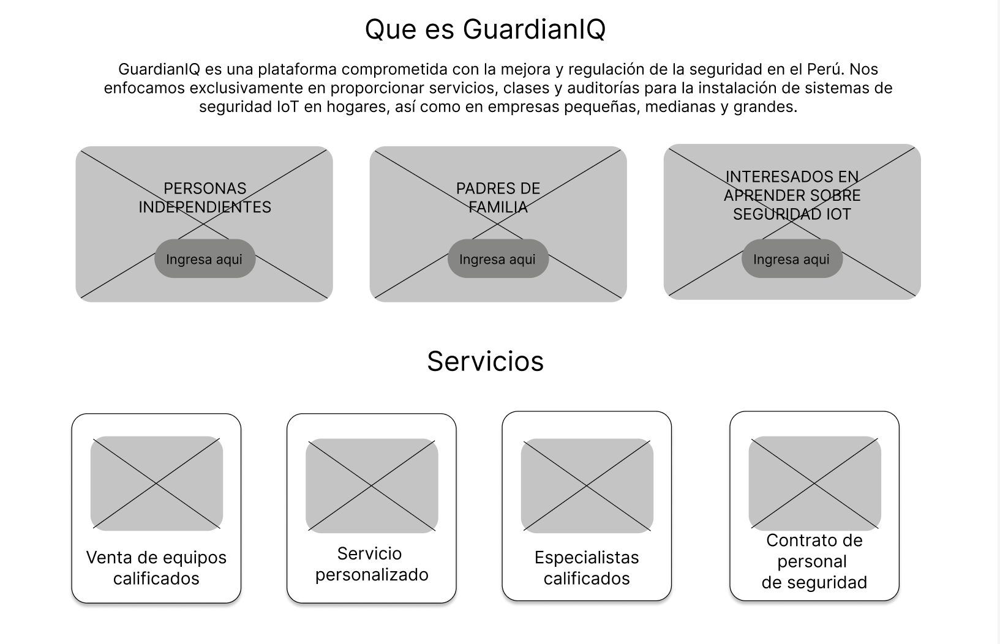
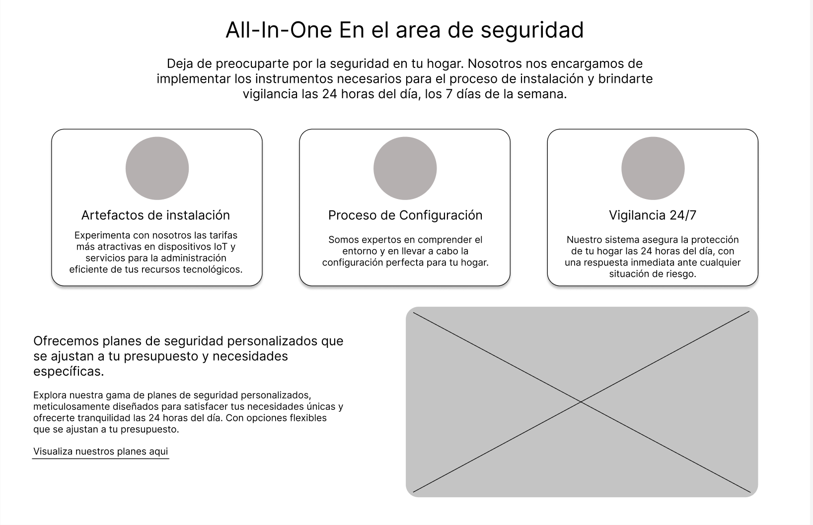
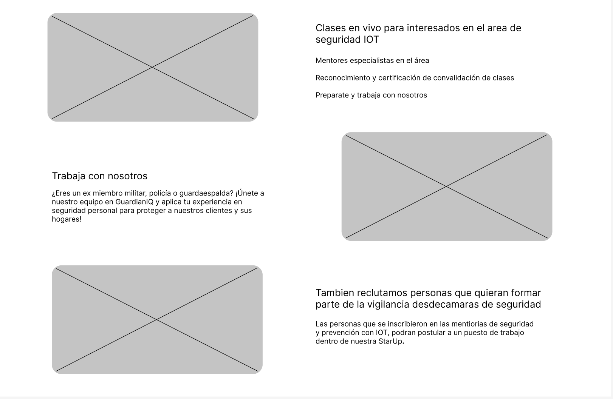
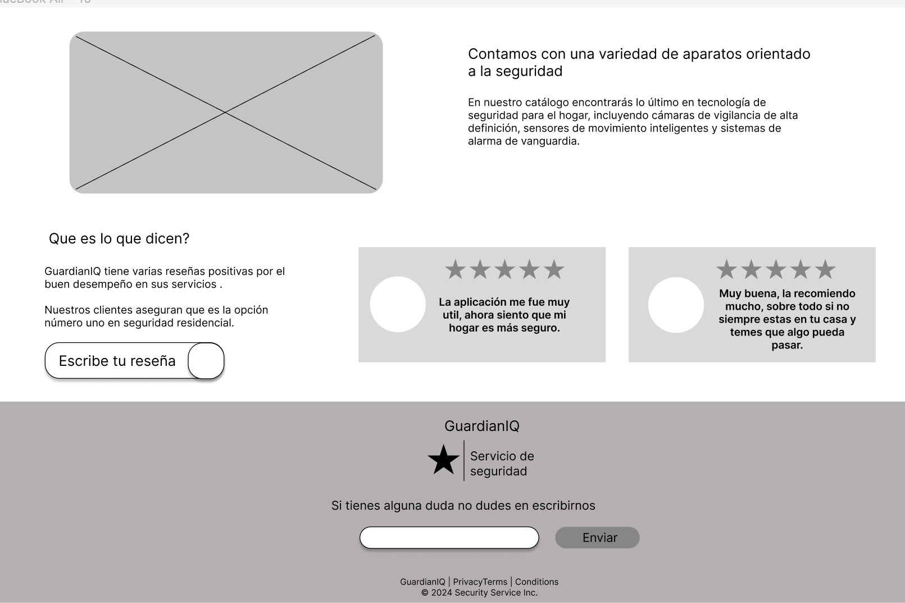
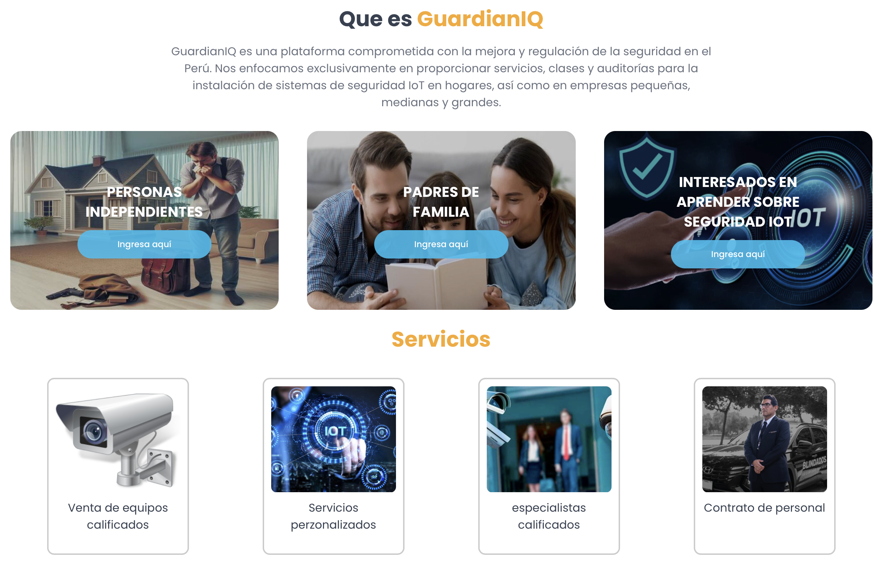
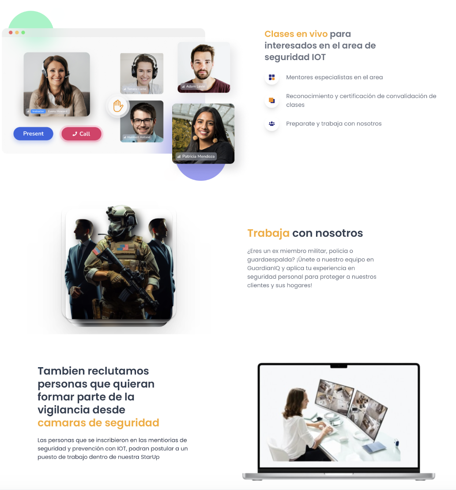
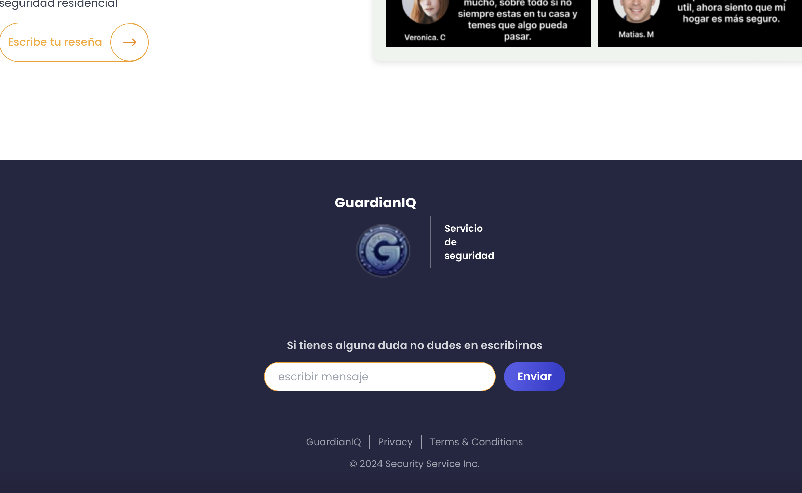

 

    <h1> Universidad Peruana de Ciencias Aplicadas </h1>

  </a>

  

    <h1> commit test </h1>

  </a>
  

  

    Ingeniería de Software - 202401
     
    SW52 - Aplicaciones Web
     
    Docente: Juan Carlos Tinoco Lica
     
    Informe de Trabajo Final
     
    Startup: 
     
    Proyecto: GuardianIQ
  

   <table border="1">
        <tr> 
            <th>Alumno</th>
            <th>Codigo</th>
        </tr>
        <tr> 
            <td>Boronda Heidinger, Astrid Jimena</td>
            <td>U202215823</td>
        </tr>
        <tr> 
            <td>Cortez Flores, Ely Rivaldo</td>
            <td>U202215313</td>
        </tr>
        <tr> 
            <td>Hidalgo Lopez, Mathias Adriano</td>
            <td>U202213222</td>
        </tr>
        <tr> 
            <td>Lobato Pozo, Sebastian Valente</td>
            <td>U202215312</td>
        </tr>
        <tr> 
            <td>Travezaño Patiño, Eduard Gedeon</td>
            <td>U20211A789</td>
        </tr>
    </table>

  

    Abril-2024
  

    

# Registro de Versiones del Informe
| Versión | Fecha       | Autor | Descripción de modificación            |
|---------|-------------|-------|----------------------------------------|
|||||
|||||
|||||

# Project Report Collaboration Insights
URL del repositorio de GitHub de la organización: [https://github.com/GuardianIQ](https://github.com/GuardianIQ)

## TB1

Para el desarrollo de la entrega TB1, se opto por dividir el trabajo de la siguiente forma

|Integrante|Actvidades Asignadas|
|----------|----------|
| | |
| | |
| | |
| | |
| | |

# Studen Outcome

|Criterio Especifico|Acciones Realizadas|Conclusiones|
|-------------------|-------------------|------------|
|Comunica oralmente sus  ideas y/o resultados con objetividad a  público de diferentes  especialidades y niveles  jerarquicos, en el marco del  desarrollo de un proyecto eningeniería.|**Astrid Boronda** TB1:  **Ely Cortez** TB1:  **Mathias Hidalgo** TB1:  **Sebastian Lobato** TB1:  **Eduard Travezaño** TB1: ||
|Comunica en forma escrita ideas  y/o resultados con objetividad a  público de diferentes  especialidades y niveles  jerarquicos, en el marco del  desarrollo de un proyecto en ingeniería.|**Astrid Boronda** TB1:  **Ely Cortez** TB1:  **Mathias Hidalgo** TB1:  **Sebastian Lobato** TB1:  **Eduard Travezaño** TB1: ||

# Contenido

- [**Capítulo I: Introducción.**](#capítulo-i-introducción)
  - [**1.1  Startup Profile.**](#11--startup-profile)
    - [**1.1.1. Descripción del startup.**](#111-descripción-del-startup)
    - [**1.1.2.  Perfiles de los integrantes del equipo.**](#112--perfiles-de-los-integrantes-del-equipo)
  - [**1.2. Solution Profile.**](#12-solution-profile)
    - [**1.2.1. Antecedentes y Problemática.**](#121-antecedentes-y-problemática)
    - [**1.2.2. Lean UX Process.**](#122-lean-ux-process)
      - [**1.2.2.1. Lean UX Problem Statements.**](#1221-lean-ux-problem-statements)
      - [**1.2.2.2. Lean UX Assumptions.**](#1222-lean-ux-assumptions)
      - [**1.2.2.3. Lean UX Hypothesis Statements.**](#1223-lean-ux-hypothesis-statements)
      - [**1.2.2.4. Lean UX Canvas.**](#1224-lean-ux-canvas)
    - [**1.2.3. Segmentos objetivo.**](#123-segmentos-objetivo)
- [**Capítulo II: Requirements Elicitation \& Analysis**](#capítulo-ii-requirements-elicitation--analysis)
  - [**2.1. Competidores.**](#21-competidores)
    - [**2.1.1. Análisis competitivo.**](#211-análisis-competitivo)
    - [**2.1.2. Estrategias y tácticas frente a competidores.**](#212-estrategias-y-tácticas-frente-a-competidores)
  - [**2.2. Entrevistas.**](#22-entrevistas)
    - [**2.2.1. Diseño de entrevistas.**](#221-diseño-de-entrevistas)
    - [**2.2.2. Registro de entrevistas.**](#222-registro-de-entrevistas)
    - [**2.2.3. Análisis de entrevistas.**](#223-análisis-de-entrevistas)
  - [**2.3. Needfinding.**](#23-needfinding)
    - [**2.3.1. User Personas.**](#231-user-personas)
    - [**2.3.2. User Task Matrix.**](#232-user-task-matrix)
    - [**2.3.3. User Journey Mapping**](#233-user-journey-mapping)
    - [**2.3.4. Empathy Mapping**](#234-empathy-mapping)
    - [**2.3.5. As-is Scenario Mapping**](#235-as-is-scenario-mapping)
  - [**2.4. Ubiquitous Language**](#24-ubiquitous-language)
- [**Capítulo III: Requirements Specification.**](#capítulo-iii-requirements-specification)
  - [**3.1. To-Be Scenario Mapping.**](#31-to-be-scenario-mapping)
  - [**3.2.User Stories.**](#32user-stories)
  - [**3.3. Impact Mapping.**](#33-impact-mapping)
  - [**3.4. Product Backlog.**](#34-product-backlog)
- [**Capítulo IV: Product Design.**](#capítulo-iv-product-design)
  - [**4.1. Style Guidelines.**](#41-style-guidelines)
    - [**4.1.1. General Style Guidelines.**](#411-general-style-guidelines)
    - [**4.1.2. Web Style Guidelines.**](#412-web-style-guidelines)
  - [**4.2. Information Architecture.**](#42-information-architecture)
    - [**4.2.1. Organization Systems.**](#421-organization-systems)
    - [**4.2.2. Labeling Systems.**](#422-labeling-systems)
    - [**4.2.3. SEO Tags and Meta Tags.**](#423-seo-tags-and-meta-tags)
    - [**4.2.4. Searching Systems.**](#424-searching-systems)
    - [**4.2.5. Navigation Systems.**](#425-navigation-systems)
  - [**4.3. Landing Page UI Design**](#43-landing-page-ui-design)
    - [**4.3.1. Landing Page Wireframe.**](#431-landing-page-wireframe)
    - [**4.3.2. Landing Page Mock-up.**](#432-landing-page-mock-up)
  - [**4.4. Web Applications UX/UI Design.**](#44-web-applications-uxui-design)
    - [**4.4.1. Web Applications Wireframes.**](#441-web-applications-wireframes)
    - [**4.4.2. Web Applications Wireflow Diagrams.**](#442-web-applications-wireflow-diagrams)
    - [**4.4.3. Web Applications Mock-ups.**](#443-web-applications-mock-ups)
    - [**4.4.4. Web Applications User Flow Diagrams.**](#444-web-applications-user-flow-diagrams)
  - [**4.5. Web Applications Prototyping.**](#45-web-applications-prototyping)
  - [**4.6. Domain-Driven Software Architecture**](#46-domain-driven-software-architecture)
    - [**4.6.1. Software Architecture Context Diagram.**](#461-software-architecture-context-diagram)
    - [**4.6.2. Software Architecture Container Diagrams.**](#462-software-architecture-container-diagrams)
    - [**4.6.3. Software Architecture Components Diagrams.**](#463-software-architecture-components-diagrams)
  - [**4.7. Software Object-Oriented Design**](#47-software-object-oriented-design)
    - [**4.7.1. Class Diagrams.**](#471-class-diagrams)
    - [**4.7.2. Class Dictionary.**](#472-class-dictionary)
  - [**4.8. Database Design.**](#48-database-design)
    - [**4.8.1. Database Diagram.**](#481-database-diagram)
- [**Capítulo V: Product Implementation, Validation \& Deployment.**](#capítulo-v-product-implementation-validation--deployment)
  - [**5.1. Software Configuration Management.**](#51-software-configuration-management)
    - [**5.1.1. Software Development Environment Configuration.**](#511-software-development-environment-configuration)
    - [**5.1.2. Source Code Management.**](#512-source-code-management)
    - [**5.1.3. Source Code Style Guide \& Conventions.**](#513-source-code-style-guide--conventions)
    - [**5.1.4. Software Deployment Configuration.**](#514-software-deployment-configuration)
  - [**5.2. Landing Page, Services \& Applications Implementation.**](#52-landing-page-services--applications-implementation)
    - [**5.2.1. Sprint 1.**](#521-sprint-1)
      - [**5.2.1.1. Sprint Planning 1.**](#5211-sprint-planning-1)
      - [**5.2.1.2. Sprint Backlog 1.**](#5212-sprint-backlog-1)
      - [**5.2.1.3. Development Evidence for Sprint Review.**](#5213-development-evidence-for-sprint-review)
      - [**5.2.1.4. Testing Suite Evidence for Sprint Review.**](#5214-testing-suite-evidence-for-sprint-review)
      - [**5.2.1.5. Execution Evidence for Sprint Review.**](#5215-execution-evidence-for-sprint-review)
      - [**5.2.1.6. Services Documentation Evidence for Sprint Review.**](#5216-services-documentation-evidence-for-sprint-review)
      - [**5.2.1.7. Software Deployment Evidence for Sprint Review.**](#5217-software-deployment-evidence-for-sprint-review)
      - [**5.2.1.8. Team Collaboration Insights during Sprint.**](#5218-team-collaboration-insights-during-sprint)

# [**Capítulo I: Introducción.**](#capítulo-i-introducción)

## [**1.1  Startup Profile.**](#startup-profile)
   
En esta sección se presenta la descripción del startup y los perfiles de los miembros del equipo.

### [**1.1.1. Descripción del startup.**](#descripción-de-la-startup)
   
   
   
   **Misión:** 
   
   **Visión:** 
   
   **Logotipo de la Startup:**

   

   **Logotipo del servicio**

  
 ### [**1.1.2.  Perfiles de los integrantes del equipo.**](#perfiles-de-integrantes-del-equipo)
| descripcion                 | Perfiles de los integrantes del equipo |
| ---                         | --- |
|  descripcion                |  foto |
| descripcion                 | foto |
| descripcion                 | foto |
| descripcion                 | foto |
| descripcion                 | foto |

## [**1.2. Solution Profile.**](#solution-profile)

### [**1.2.1. Antecedentes y Problemática.**](#antecedentes-y-problemática)

##### What (Qué)

###### ¿Cuál es el problema?

##### When (Cuando)

###### ¿Cuándo sucede el problema?

##### Where (Donde)
###### ¿A dónde se dirige?

###### ¿Dónde surge el problema?

##### Who (Quién)
###### ¿Quiénes están involucrados? ¿Quién lo utilizará?

##### Why (Por qué)
###### ¿Cuál es la causa del problema?

### ¿Cuáles son las 2H?

##### How (Cómo)
###### ¿Cómo se utilizará el producto?

###### ¿Cómo lograremos desarrollar la correcta gestión del proceso de carpooling entre estudiantes?

##### How much (Cuánto)
###### ¿Cuál es la magnitud del problema?

###### Quienes seran los beneficiados por el servicio?

### [**1.2.2. Lean UX Process.**](#lean-ux-process)
#### [**1.2.2.1. Lean UX Problem Statements.**](#lean-ux-problem-statements)
   
###### Problem Statement:

#### [**1.2.2.2. Lean UX Assumptions.**](#lean-ux-assumptions)

#### [**1.2.2.3. Lean UX Hypothesis Statements.**](#lean-ux-hypothesis-statements)

#### [**1.2.2.4. Lean UX Canvas.**](#lean-ux-canvas)

### [**1.2.3. Segmentos objetivo.**](#segmentos-objetivo)

# [**Capítulo II: Requirements Elicitation & Analysis**](#capítulo-ii-requirements-elicitation--analysis)

## [**2.1. Competidores.**](#competidores)

### [**2.1.1. Análisis competitivo.**](#análisis-competitivo)

|Tipo | logo    |  nuestro logo |  |      |  |
|---------|---------|-------------|------------|--------------------|------------|
|Perfil|Overview||||
|Perfil|Ventaja competitiva ¿Qué valor ofrece a los clientes? ||||
|Perfil de Marketing |Mercado objetivo ||||
|Perfil de Marketing |Estrategias de marketing  ||||
|Perfil de Producto|Productos & Servicios  ||||
|Perfil de Producto|Precios & Costos  ||||
|Perfil de Producto|Canales de distribución (Web y/o Móvil)  ||||
|Análisis SWOT|Fortalezas  ||||
|Análisis SWOT|Debilidades ||||
|Análisis SWOT|Oportunidades ||||
|Análisis SWOT|Amenazas ||||

     
### [**2.1.2. Estrategias y tácticas frente a competidores.**](#estrategias-y-tácticas-frente-a-competidores)

## [**2.2. Entrevistas.**](entrevistas)
   
### [**2.2.1. Diseño de entrevistas.**](#diseño-de-entrevistas)

**Segmento objetivo #1:**
### Preguntas principales:

### Preguntas complementarias:

**Segmento objetivo #1:**

### Preguntas principales:

### Preguntas complementarias:

### [**2.2.2. Registro de entrevistas.**](#registro-de-entrevistas)

**Segmento objetivo #1:** 

**Entrevistado N°1:** 

- **Sexo:** Femenino

- **Edad:** 19 años

- **Ubicación en la que vive:** 

**Acerca de la entrevista:**

- **Link:** ------------------

- **Instante en el que inicia:** ----------

- **Duración:** --------

**Resumen:**

Texto

**Entrevistado N°2:** ---------------

- **Sexo:** ------

- **Edad:** ------

- **Ubicación en la que vive:** --------------

**Acerca de la entrevista:**

- **Link:** ------------------

- **Instante en el que inicia:** ----------

- **Duración:** --------

**Resumen:**

Texto

**Entrevistado N°3:** ---------------

- **Sexo:** ------

- **Edad:** ------

- **Ubicación en la que vive:** --------------

**Acerca de la entrevista:**

- **Link:** ------------------

- **Instante en el que inicia:** ----------

- **Duración:** --------

**Resumen:**

Texto

**Segmento objetivo #2:** 

**Entrevistado N°1:** ---------------

**- Sexo:** ------

**- Edad:** ------

**- Ubicación en la que vive:** --------------

**Acerca de la entrevista:**

**- Link:** ------------------

**- Instante en el que inicia:** ----------

**- Duración:** --------

**Resumen:**

Texto

**Entrevistado N°2:** ---------------

**- Sexo:** ------

**- Edad:** ------

**- Ubicación en la que vive:** --------------

**Acerca de la entrevista:**

**- Link:** ------------------

**- Instante en el que inicia:** ----------

**- Duración:** --------

**Resumen:**

Texto

**Entrevistado N°3:** ---------------

**- Sexo:** ------

**- Edad:** ------

**- Ubicación en la que vive:** --------------

**Acerca de la entrevista:**

**- Link:** ------------------

**- Instante en el que inicia:** ----------

**- Duración:** --------

**Resumen:**

Texto

### [**2.2.3. Análisis de entrevistas.**](#análisis-de-entrevistas)

De acuerdo con las entrevistas y resúmenes recopilados, hemos realizado el siguiente análisis de entrevistas, obteniendo así resultados concretos. 

#### Segmento objetivo #1:

Hallazgos:

- 
  
- 
  
- 
  
- 
  
- 
  
Hallazgos:

#### Segmento objetivo #2: 

- 
  
- 
  
- 
  
- 
  
- 
  
Conclusiones:

### Análisis por medio de herramientas estadísticas:

- Segmento objetivo1: 

- Segmento objetivo 2: 

## [**2.3. Needfinding.**](#needfinding)

Presentamos las siguientes necesidades principales que hemos analizado en base a nuestros usuarios:

*Segmento #1:*
-
-
-
-
-
*Segmento #2:* 
-
-
-
-
-

### [**2.3.1. User Personas.**](#user-personas)

### [**2.3.2. User Task Matrix.**](#user-task-matrix)

### [**2.3.3. User Journey Mapping**](#user-journey-mapping)

### [**2.3.4. Empathy Mapping**](#empathy-mapping)

### [**2.3.5. As-is Scenario Mapping**](as-is-scenario-mapping)

## [**2.4. Ubiquitous Language**](#ubiquitous-language)

# [**Capítulo III: Requirements Specification.**](#capítulo-iii-requirements-specification)

## [**3.1. To-Be Scenario Mapping.**](#to-be-scenario-mapping)

## [**3.2.User Stories.**](#user-stories)

## [**3.3. Impact Mapping.**](#impact-mapping)

## [**3.4. Product Backlog.**](#product-backlog)

# [**Capítulo IV: Product Design.**](#capítulo-iv-product-design)

## [**4.1. Style Guidelines.**](#style-guidelines)

### [**4.1.1. General Style Guidelines.**](#style-guidelines)

### [**4.1.2. Web Style Guidelines.**](#web-style-guidelines)

## [**4.2. Information Architecture.**](#information-architecture)

### [**4.2.1. Organization Systems.**](#organization-systems)

### [**4.2.2. Labeling Systems.**](#labeling-systems)

### [**4.2.3. SEO Tags and Meta Tags.**](#seo-tags-and-meta-tags)

### [**4.2.4. Searching Systems.**](#searching-systems)

### [**4.2.5. Navigation Systems.**](#navigation-systems)

## [**4.3. Landing Page UI Design**](#landing-page-ui-design)

### [**4.3.1. Landing Page Wireframe.**](#landing-page-wireframe)

### [**4.3.2. Landing Page Mock-up.**](#landing-page-mock-up)

## [**4.4. Web Applications UX/UI Design.**](#web-applications-ux-ui-design)

### [**4.4.1. Web Applications Wireframes.**](#web-applications-wireframes)

### [**4.4.2. Web Applications Wireflow Diagrams.**](#web-applications-wireflow-diagrams)

### [**4.4.3. Web Applications Mock-ups.**](#web-applications-mock-ups)

### [**4.4.4. Web Applications User Flow Diagrams.**](#web-applications-user-flow-diagrams)

## [**4.5. Web Applications Prototyping.**](#web-applications-prototyping)

## [**4.6. Domain-Driven Software Architecture**](#domain-driven-software-architecture)

### [**4.6.1. Software Architecture Context Diagram.**](#software-architecture-context-diagram)

### [**4.6.2. Software Architecture Container Diagrams.**](#software-architecture-container-diagrams)

### [**4.6.3. Software Architecture Components Diagrams.**](#software-architecture-components-diagrams)

## [**4.7. Software Object-Oriented Design**](#software-object-oriented-design)

### [**4.7.1. Class Diagrams.**](#class-diagrams)

### [**4.7.2. Class Dictionary.**](#class-dictionary)

## [**4.8. Database Design.**](#database-design)

### [**4.8.1. Database Diagram.**](#database-diagram)

# [**Capítulo V: Product Implementation, Validation & Deployment.**](#capítulo-v-product-implementation-validation--deployment)

## [**5.1. Software Configuration Management.**](#software-configuration-management)

### [**5.1.1. Software Development Environment Configuration.**](#software-development-environment-configuration)

**Project Management:**

* _Trello_:  Es una plataforma de gestión de proyectos que facilita la colaboración en tiempo real, la organización de tareas. En nuestra StarUp, GuardianIQ, empleamos Trello para coordinar y supervisar el avance de nuestros proyectos, asignar responsabilidades a los miembros del equipo y mantenernos organizados en todo momento. Gracias a la interfaz amigable y las opciones de personalización de Trello, podemos adaptar la herramienta según nuestras necesidades específicas y asegurar una gestión eficiente de nuestros proyectos. 

### [**5.1.2. Source Code Management.**](#source-code-management)

### [**5.1.3. Source Code Style Guide & Conventions.**](#source-code-style-guide--conventions)

### [**5.1.4. Software Deployment Configuration.**](#software-deployment-configuration)

## [**5.2. Landing Page, Services & Applications Implementation.**](#landing-page-services--applications-implementation)

### [**5.2.1. Sprint 1.**](#sprint-1)

#### [**5.2.1.1. Sprint Planning 1.**](#sprint-planning-1)

#### [**5.2.1.2. Sprint Backlog 1.**](#sprint-backlog-1)

#### [**5.2.1.3. Development Evidence for Sprint Review.**](#development-evidence-for-sprint-review)

#### [**5.2.1.4. Testing Suite Evidence for Sprint Review.**](#testing-suite-evidence-for-sprint-review)

#### [**5.2.1.5. Execution Evidence for Sprint Review.**](#execution-evidence-for-sprint-review)

#### [**5.2.1.6. Services Documentation Evidence for Sprint Review.**](#services-documentation-evidence-for-sprint-review)

#### [**5.2.1.7. Software Deployment Evidence for Sprint Review.**](#software-deployment-evidence-for-sprint-review)

#### [**5.2.1.8. Team Collaboration Insights during Sprint.**](#team-collaboration-insights-during-sprint)
