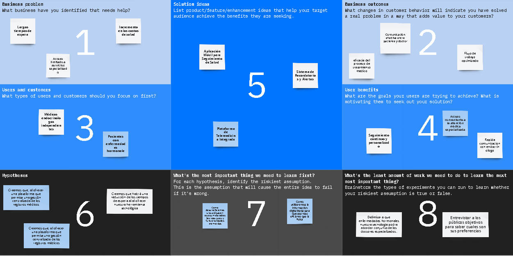

 

    <h1> Universidad Peruana de Ciencias Aplicadas </h1>

  </a>

  

    <h1> commit test </h1>

  </a>
  

  

    Ingeniería de Software - 202401
     
    SW52 - Aplicaciones Web
     
    Docente: Juan Carlos Tinoco Lica
     
    Informe de Trabajo Final
     
    Startup: 
     
    Proyecto: GuardianIQ
  

   <table border="1">
        <tr> 
            <th>Alumno</th>
            <th>Codigo</th>
        </tr>
        <tr> 
            <td>Boronda Heidinger, Astrid Jimena</td>
            <td>U202215823</td>
        </tr>
        <tr> 
            <td>Cortez Flores, Ely Rivaldo</td>
            <td>U202215313</td>
        </tr>
        <tr> 
            <td>Hidalgo Lopez, Mathias Adriano</td>
            <td>U202213222</td>
        </tr>
        <tr> 
            <td>Lobato Pozo, Sebastian Valente</td>
            <td>U202215312</td>
        </tr>
        <tr> 
            <td>Travezaño Patiño, Eduard Gedeon</td>
            <td>U20211A789</td>
        </tr>
    </table>

  

    Abril-2024
  

    

# Registro de Versiones del Informe
| Versión | Fecha       | Autor | Descripción de modificación            |
|---------|-------------|-------|----------------------------------------|
|||||
|||||
|||||

# Project Report Collaboration Insights
URL del repositorio de GitHub de la organización: [https://github.com/GuardianIQ](https://github.com/GuardianIQ)

## TB1

Para el desarrollo de la entrega TB1, se opto por dividir el trabajo de la siguiente forma

|Integrante|Actvidades Asignadas|
|----------|----------|
| | |
| | |
| | |
| | |
| | |

# Studen Outcome

|Criterio Especifico|Acciones Realizadas|Conclusiones|
|-------------------|-------------------|------------|
|Comunica oralmente sus  ideas y/o resultados con objetividad a  público de diferentes  especialidades y niveles  jerarquicos, en el marco del  desarrollo de un proyecto eningeniería.|**Astrid Boronda** TB1:  **Ely Cortez** TB1:  **Mathias Hidalgo** TB1:  **Sebastian Lobato** TB1:  **Eduard Travezaño** TB1: ||
|Comunica en forma escrita ideas  y/o resultados con objetividad a  público de diferentes  especialidades y niveles  jerarquicos, en el marco del  desarrollo de un proyecto en ingeniería.|**Astrid Boronda** TB1:  **Ely Cortez** TB1:  **Mathias Hidalgo** TB1:  **Sebastian Lobato** TB1:  **Eduard Travezaño** TB1: ||

# Contenido

- [**Capítulo I: Introducción.**](#capítulo-i-introducción)
  - [**1.1  Startup Profile.**](#11--startup-profile)
    - [**1.1.1. Descripción del startup.**](#111-descripción-del-startup)
    - [**1.1.2.  Perfiles de los integrantes del equipo.**](#112--perfiles-de-los-integrantes-del-equipo)
  - [**1.2. Solution Profile.**](#12-solution-profile)
    - [**1.2.1. Antecedentes y Problemática.**](#121-antecedentes-y-problemática)
    - [**1.2.2. Lean UX Process.**](#122-lean-ux-process)
      - [**1.2.2.1. Lean UX Problem Statements.**](#1221-lean-ux-problem-statements)
      - [**1.2.2.2. Lean UX Assumptions.**](#1222-lean-ux-assumptions)
      - [**1.2.2.3. Lean UX Hypothesis Statements.**](#1223-lean-ux-hypothesis-statements)
      - [**1.2.2.4. Lean UX Canvas.**](#1224-lean-ux-canvas)
    - [**1.2.3. Segmentos objetivo.**](#123-segmentos-objetivo)
- [**Capítulo II: Requirements Elicitation \& Analysis**](#capítulo-ii-requirements-elicitation--analysis)
  - [**2.1. Competidores.**](#21-competidores)
    - [**2.1.1. Análisis competitivo.**](#211-análisis-competitivo)
    - [**2.1.2. Estrategias y tácticas frente a competidores.**](#212-estrategias-y-tácticas-frente-a-competidores)
  - [**2.2. Entrevistas.**](#22-entrevistas)
    - [**2.2.1. Diseño de entrevistas.**](#221-diseño-de-entrevistas)
    - [**2.2.2. Registro de entrevistas.**](#222-registro-de-entrevistas)
    - [**2.2.3. Análisis de entrevistas.**](#223-análisis-de-entrevistas)
  - [**2.3. Needfinding.**](#23-needfinding)
    - [**2.3.1. User Personas.**](#231-user-personas)
    - [**2.3.2. User Task Matrix.**](#232-user-task-matrix)
    - [**2.3.3. User Journey Mapping**](#233-user-journey-mapping)
    - [**2.3.4. Empathy Mapping**](#234-empathy-mapping)
    - [**2.3.5. As-is Scenario Mapping**](#235-as-is-scenario-mapping)
  - [**2.4. Ubiquitous Language**](#24-ubiquitous-language)
- [**Capítulo III: Requirements Specification.**](#capítulo-iii-requirements-specification)
  - [**3.1. To-Be Scenario Mapping.**](#31-to-be-scenario-mapping)
  - [**3.2.User Stories.**](#32user-stories)
  - [**3.3. Impact Mapping.**](#33-impact-mapping)
  - [**3.4. Product Backlog.**](#34-product-backlog)
- [**Capítulo IV: Product Design.**](#capítulo-iv-product-design)
  - [**4.1. Style Guidelines.**](#41-style-guidelines)
    - [**4.1.1. General Style Guidelines.**](#411-general-style-guidelines)
    - [**4.1.2. Web Style Guidelines.**](#412-web-style-guidelines)
  - [**4.2. Information Architecture.**](#42-information-architecture)
    - [**4.2.1. Organization Systems.**](#421-organization-systems)
    - [**4.2.2. Labeling Systems.**](#422-labeling-systems)
    - [**4.2.3. SEO Tags and Meta Tags.**](#423-seo-tags-and-meta-tags)
    - [**4.2.4. Searching Systems.**](#424-searching-systems)
    - [**4.2.5. Navigation Systems.**](#425-navigation-systems)
  - [**4.3. Landing Page UI Design**](#43-landing-page-ui-design)
    - [**4.3.1. Landing Page Wireframe.**](#431-landing-page-wireframe)
    - [**4.3.2. Landing Page Mock-up.**](#432-landing-page-mock-up)
  - [**4.4. Web Applications UX/UI Design.**](#44-web-applications-uxui-design)
    - [**4.4.1. Web Applications Wireframes.**](#441-web-applications-wireframes)
    - [**4.4.2. Web Applications Wireflow Diagrams.**](#442-web-applications-wireflow-diagrams)
    - [**4.4.3. Web Applications Mock-ups.**](#443-web-applications-mock-ups)
    - [**4.4.4. Web Applications User Flow Diagrams.**](#444-web-applications-user-flow-diagrams)
  - [**4.5. Web Applications Prototyping.**](#45-web-applications-prototyping)
  - [**4.6. Domain-Driven Software Architecture**](#46-domain-driven-software-architecture)
    - [**4.6.1. Software Architecture Context Diagram.**](#461-software-architecture-context-diagram)
    - [**4.6.2. Software Architecture Container Diagrams.**](#462-software-architecture-container-diagrams)
    - [**4.6.3. Software Architecture Components Diagrams.**](#463-software-architecture-components-diagrams)
  - [**4.7. Software Object-Oriented Design**](#47-software-object-oriented-design)
    - [**4.7.1. Class Diagrams.**](#471-class-diagrams)
    - [**4.7.2. Class Dictionary.**](#472-class-dictionary)
  - [**4.8. Database Design.**](#48-database-design)
    - [**4.8.1. Database Diagram.**](#481-database-diagram)
- [**Capítulo V: Product Implementation, Validation \& Deployment.**](#capítulo-v-product-implementation-validation--deployment)
  - [**5.1. Software Configuration Management.**](#51-software-configuration-management)
    - [**5.1.1. Software Development Environment Configuration.**](#511-software-development-environment-configuration)
    - [**5.1.2. Source Code Management.**](#512-source-code-management)
    - [**5.1.3. Source Code Style Guide \& Conventions.**](#513-source-code-style-guide--conventions)
    - [**5.1.4. Software Deployment Configuration.**](#514-software-deployment-configuration)
  - [**5.2. Landing Page, Services \& Applications Implementation.**](#52-landing-page-services--applications-implementation)
    - [**5.2.1. Sprint 1.**](#521-sprint-1)
      - [**5.2.1.1. Sprint Planning 1.**](#5211-sprint-planning-1)
      - [**5.2.1.2. Sprint Backlog 1.**](#5212-sprint-backlog-1)
      - [**5.2.1.3. Development Evidence for Sprint Review.**](#5213-development-evidence-for-sprint-review)
      - [**5.2.1.4. Testing Suite Evidence for Sprint Review.**](#5214-testing-suite-evidence-for-sprint-review)
      - [**5.2.1.5. Execution Evidence for Sprint Review.**](#5215-execution-evidence-for-sprint-review)
      - [**5.2.1.6. Services Documentation Evidence for Sprint Review.**](#5216-services-documentation-evidence-for-sprint-review)
      - [**5.2.1.7. Software Deployment Evidence for Sprint Review.**](#5217-software-deployment-evidence-for-sprint-review)
      - [**5.2.1.8. Team Collaboration Insights during Sprint.**](#5218-team-collaboration-insights-during-sprint)

# [**Capítulo I: Introducción.**](#capítulo-i-introducción)

## [**1.1  Startup Profile.**](#startup-profile)
   
Coritech, una iniciativa nacida de un grupo de estudiantes de la Universidad Peruana de Ciencias Aplicadas, se centra en ofrecer una solución innovadora para las necesidades de seguridad de individuos y familias en el Perú. Con un enfoque claro en conectar a usuarios con servicios de vigilancia de cámaras de seguridad y personal de seguridad para eventos o vigilancia en sitio, Coritech, se posiciona como un puente seguro y confiable entre aquellos que buscan proteger sus propiedades y eventos importantes y aquellos que están capacitados para brindar esos servicios. Según datos del Instituto Nacional de Estadística e Informática (INEI) del Perú, el 62% de los hogares en áreas urbanas del país tienen algún tipo de sistema de seguridad instalado (INEI, 2022). Nuestra plataforma se destaca por su riguroso proceso de selección, garantizando que solo los profesionales de seguridad más calificados y confiables estén disponibles para nuestros usuarios. En un contexto donde la seguridad es una preocupación creciente,Coritech prioriza la seguridad y la privacidad de nuestros clientes, implementando medidas sólidas de seguridad de datos y protección de la privacidad. Nuestro compromiso es proporcionar acceso fácil y confiable a servicios de seguridad de alta calidad para individuos, familias y organizadores de eventos, contribuyendo así a la seguridad y tranquilidad de nuestra comunidad.

### [**1.1.1. Descripción del startup.**](#descripción-de-la-startup)
   
Somos una startup que se enfoca en el desarrollo de una plataforma en línea que conecta a individuos y familias con profesionales calificados en seguridad en el Perú. Ofrecemos soluciones confiables y accesibles para satisfacer las necesidades de seguridad de nuestros usuarios, priorizando la excelencia en el servicio y la tranquilidad de nuestras comunidades.

Nuestro enfoque se centra en proporcionar soluciones de seguridad accesibles, confiables e innovadoras para satisfacer las necesidades específicas de nuestros usuarios. Nos comprometemos a ofrecer:

**Visión**:
Ser la plataforma líder en el Perú que brinda acceso confiable y conveniente a servicios de seguridad de alta calidad, mejorando la tranquilidad y protección de las personas, familias y comunidades.

**Misión**:
En Coritech, nos comprometemos a proporcionar una solución innovadora y accesible para las necesidades de seguridad de nuestros usuarios, conectando de manera eficiente a individuos y familias con profesionales calificados en el campo de la seguridad. Nos esforzamos por garantizar la excelencia en nuestros servicios, priorizando la seguridad, la privacidad y la satisfacción del cliente en todo momento. A través de nuestra plataforma, buscamos contribuir de manera significativa a la seguridad y bienestar de nuestra sociedad.

**Valores**: En Coritech, nuestros valores son la confianza, la seguridad, la excelencia, la innovación y la accesibilidad. Nos comprometemos a construir relaciones sólidas y seguras con nuestros usuarios y profesionales de seguridad, priorizando la protección y el bienestar en cada interacción
   
   **Logotipo de la Startup:**

   **Logotipo del servicio**

  
 ### [**1.1.2.  Perfiles de los integrantes del equipo.**](#perfiles-de-integrantes-del-equipo)
| descripcion                 | Perfiles de los integrantes del equipo |
| ---                         | --- |
|  descripcion                |  foto |
| descripcion                 | foto |
| descripcion                 | foto |
| descripcion                 | foto |
| descripcion                 | foto |

## [**1.2. Solution Profile.**](#solution-profile)

GuardianIQ es una plataforma digital innovadora que ofrece soluciones integrales de seguridad para individuos y familias en el Perú. Nuestra plataforma conecta a usuarios con necesidades de seguridad, como vigilancia de cámaras y personal de seguridad para eventos, con profesionales calificados en el campo de la seguridad. Nos destacamos por nuestra accesibilidad, confiabilidad y enfoque centrado en el usuario.

### [**1.2.1. Antecedentes y Problemática.**](#antecedentes-y-problemática)

Según datos del Instituto Nacional de Estadística e Informática (INEI), durante los primeros seis meses del año 2022, se reportaron cifras preocupantes sobre la seguridad en zonas urbanas de Perú. Estas cifras revelan que aproximadamente el 10,1% de las viviendas fueron objeto de robos o intentos de robo. Estas estadísticas ponen de relieve la gravedad del problema de seguridad que enfrentan muchas comunidades urbanas en el país. El hecho de que más del 10% de las viviendas en estas áreas hayan sido afectadas por robos o intentos de robo en tan corto periodo de tiempo subraya la necesidad de abordar este problema de manera integral y eficaz.

##### What (Qué)

El problema es la alta tasa de delincuencia en las áreas urbanas de Perú.

###### ¿Cuál es el problema?

La relación del usuario con el problema es directa ya que la persona en cuestión busca proteger sus propiedades, eventos importantes o bienestar personal y familiar. Esta persona busca una herramienta que le permita mitigar el riesgo a ser víctima de robos y proteger a sus seres queridos.

##### When (Cuando)

La delincuencia en el sector urbano puede ocurrir en cualquier momento, ya que los delincuentes pueden aprovechar oportunidades cuando las viviendas están desocupadas o no hay una seguridad eficaz

###### ¿Cuándo sucede el problema?

El problema surge cuando las personas enfrentan situaciones de riesgo o inseguridad, o cuando tienen preocupación o buscan prevenir y proteger a ellos mismos o seres queridos. Por ejemplo, la necesidad de proteger sus propiedades en ausencia.

###### ¿Cuándo utiliza el cliente el producto? 

El problema surge cuando las personas enfrentan situaciones de riesgo o inseguridad, o cuando tienen preocupación o buscan prevenir y proteger a ellos mismos o seres queridos. Por ejemplo, la necesidad de proteger sus propiedades en ausencia.

##### Where (Donde)

##### ¿Dónde está el cliente cuando usa el producto?
El cliente utiliza el producto desde su ubicación física, que puede ser su hogar o cualquier otro lugar, accediendo a la aplicación a través de dispositivos electrónicos como teléfonos móviles, tabletas o computadoras, utilizando internet para la conexión y funcionamiento del sistema.

###### ¿A dónde se dirige?

El cliente puede utilizar la aplicación desde la comodidad de su hogar o incluso cuando está fuera de casa, mediante distintos dispositivos electrónicos.

###### ¿Dónde surge el problema?

El problema puede surgir en cualquier área urbana de Perú. Estos delitos pueden ocurrir en diversos vecindarios y localidades, ya sea en zonas residenciales, comerciales o mixtas, y pueden afectar tanto a propiedades individuales como a complejos de viviendas.

##### Who (Quién)
###### ¿Quiénes están involucrados? ¿Quién lo utilizará?

Personas que desean proteger sus residencias de manera efectiva contra intrusiones y otros eventos no deseados.

###### ¿A quiénes le sucede el problema? 

Este problema le puede suceder a: propietarios de viviendas e inquilinos, entre estas quienes pueden ser familias o personas independientes.

###### ¿Quién lo utilizará? 

La aplicación está destinada para ser utilizada por familias y adultos independientes.

##### Why (Por qué)
###### ¿Cuál es la causa del problema?

La causa del problema es el aumento de la delincuencia en el país lo que genera una percepción de inseguridad.

### ¿Cuáles son las 2H?

##### How (Cómo)
###### ¿En qué condiciones los clientes usan nuestro producto? 
Los clientes utilizan GuardianIQ siempre que desean supervisar y asegurar su hogar, independientemente de la hora del día o de su ubicación, para mantener un control constante y obtener una mayor tranquilidad en relación con la seguridad de su residencia.

###### ¿Qué llevará a la persona a usar nuestro producto?

Las personas utilizarán GuardianIQ principalmente por su necesidad de contar con seguridad para proteger su hogar o seres queridos.

###### ¿Cuál sería el impacto al implementar esta aplicación?

La implementación del servicio de vigilancia de GuardianIQ ofrecería a los usuarios una protección personalizada y efectiva para sus hogares, brindándoles una mayor seguridad y tranquilidad en su vida diaria.

### [**1.2.2. Lean UX Process.**](#lean-ux-process)
#### [**1.2.2.1. Lean UX Problem Statements.**](#lean-ux-problem-statements)

**Problema 1:**

Los usuarios encuentran difícil configurar y utilizar nuestra aplicación de monitoreo de cámaras debido a la falta de orientación y diseño intuitivo, lo que resulta en una experiencia de usuario confusa y frustrante.

**Problema 2:**

Los clientes experimentan una desconexión entre la detección de amenazas en sus cámaras de seguridad y la acción adecuada a tomar, lo que resulta en una respuesta lenta o inadecuada ante situaciones de emergencia.

**Problema 3:**

Existe una brecha de confianza entre nuestros usuarios y el servicio de vigilancia remota, debido a preocupaciones sobre la privacidad de sus datos y la capacidad de los vigilantes para proteger adecuadamente sus hogares y propiedades.
   
###### Problem Statement:

#### [**1.2.2.2. Lean UX Assumptions.**](#lean-ux-assumptions)

**Business assumptions:

Se asume que los usuarios están dispuestos a pagar por un servicio de vigilancia remota de sus cámaras de seguridad debido a su preocupación por la seguridad de sus hogares y propiedades.

Se asume que los usuarios prefieren un servicio de vigilancia remota ofrecido por profesionales capacitados en lugar de depender únicamente de sistemas de seguridad automatizados.

Se asume que los usuarios valoran la conveniencia y la tranquilidad que ofrece un servicio de vigilancia remota, lo que les permite monitorear sus hogares incluso cuando están ausentes.

Se asume que la privacidad y la protección de los datos son preocupaciones principales para los usuarios al utilizar un servicio de vigilancia remota, y están dispuestos a confiar en nuestra empresa para salvaguardar esta información de manera adecuada.

**User Assumptions:**

###### ¿Quién es el usuario? 

El usuario de GuardianIQ son personas independientes y padres de familia
¿Dónde encaja nuestro producto en su trabajo o vida?
Encaja en la vida diaria y en el trabajo de nuestros usuarios ya que al tener una aplicación conectada a su hogar pueden estar pendientes de su hogar sin importar donde estén en el gimnasio, de compras, con sus hijos, en el trabajo. SecureIA permite esa facilidad de monitoreo. 

###### ¿Qué problemas tiene nuestro producto? ¿Resolver? 

GuardianIQ puede enfrentar desafíos en la configuración inicial asi como la preocupación sobre la privacidad y la confiabilidad del servicio de vigilancia remota de cámaras o personal de seguridad. 

###### ¿Cuándo y cómo es nuestro producto? ¿Usado? 

GuardianIQ se utiliza tanto durante el día como durante la noche, ya que la delincuencia puede ocurrir en cualquier momento. 

###### ¿Qué características son importantes? 

Una interfaz donde el usuario pueda adquirir los servicios de vigilancia remota de cámaras por parte de profesionales capacitados, asesoramiento en dispositivos IoT para mejorar la seguridad del hogar, y una respuesta rápida ante emergencias. Además, la contratación de personal de seguridad presencial puede ser una opción para aquellos que buscan una protección adicional.

###### ¿Cómo debe verse nuestro producto y cómo comportarse?

GuardianIQ debe presentarse como una solución integral y confiable para la seguridad en zonas urbanas. La interfaz de usuario debe ser intuitiva y fácil de usar, y el servicio debe comportarse de manera confiable y eficiente, brindando a los usuarios la tranquilidad y la protección que necesitan en un entorno urbano desafiante.

#### [**1.2.2.3. Lean UX Hypothesis Statements.**](#lean-ux-hypothesis-statements)

###### Hypothesis 01

Creemos que al desarrollar la aplicación GuardianIQ con una interfaz interactiva, fácil de usar y un tutorial de inicio, mejorará la experiencia del usuario y su satisfacción. Consideraremos que hemos tenido éxito cuando al menos el 80% de los usuarios emitan comentarios positivos sobre la interfaz en la tienda de descargas, además de alcanzar un promedio de calificación de 4.5 estrellas en la App Store/Play Store.
###### Hypothesis 02

Creemos que al vincular las notificaciones clave con el dispositivo móvil del cliente en GuardianIQ, permitirá un mejor seguimiento del hogar y una notificación inmediata en caso de que el personal  detecte movimientos o comportamientos extraños en la localización. Consideraremos que hemos tenido éxito cuando observamos un aumento del 45% en el seguimiento de los hogares por parte de los clientes al detectarse una actividad inusual.

###### Hypothesis 03
Creemos que al implementar planes de servicio con diferentes rangos de precios en GuardianIQ, aumentaremos el acceso a más hogares. Consideraremos que hemos tenido éxito cuando observemos un incremento del 15% en el número de familias que eligen nuestro producto debido a la variedad de precios que se ajustan a sus necesidades y posibilidades.

#### [**1.2.2.4. Lean UX Canvas.**](#lean-ux-canvas)

[https://miro.com/app/board/uXjVKU1mM2Y=/?share_link_id=551111949405](https://miro.com/app/board/uXjVKU1mM2Y=/?share_link_id=551111949405)

### [**1.2.3. Segmentos objetivo.**](#segmentos-objetivo)

**Segmento de Adultos Independientes:**

GuardianIQ se enfoca en adultos independientes, ya sea que vivan solos o compartan su hogar con compañeros de cuarto. Este grupo demográfico tiende a tener ingresos estables y llevar un estilo de vida activo fuera de casa. Priorizando la seguridad de su hogar, buscan soluciones prácticas y efectivas para proteger sus propiedades y pertenencias mientras están fuera. GuardianIQ ofrece una solución facilitando la instalación de dispositivos IOT, y su monitoreo constante en tiempo real, asi como notificaciones en caso de intrusión.

**Segmento de Padres de Familia:**

GuardianIQ también está diseñado para padres de familia que tienen hijos pequeños o adolescentes en casa y que dan prioridad a la seguridad de su hogar y de su familia. Estas personas buscan soluciones de seguridad integrales que les permitan tener bajo vigilancia y resguardo a sus hijos, asi como proteger su hogar mientras están en el trabajo o de vacaciones. GuardianIQ se esfuerza por brindar accesibilidad y aceptación a los padres para estas nuevas tecnologías, permitiéndoles una manera efectiva de proteger a sus hijos y hogares. La aplicación proporciona tranquilidad a los padres al brindarles este servicio.

# [**Capítulo II: Requirements Elicitation & Analysis**](#capítulo-ii-requirements-elicitation--analysis)

## [**2.1. Competidores.**](#competidores)

### [**2.1.1. Análisis competitivo.**](#análisis-competitivo)

|Tipo | logo    |  nuestro logo |  |      |  |
|---------|---------|-------------|------------|--------------------|------------|
|Perfil|Overview||||
|Perfil|Ventaja competitiva ¿Qué valor ofrece a los clientes? ||||
|Perfil de Marketing |Mercado objetivo ||||
|Perfil de Marketing |Estrategias de marketing  ||||
|Perfil de Producto|Productos & Servicios  ||||
|Perfil de Producto|Precios & Costos  ||||
|Perfil de Producto|Canales de distribución (Web y/o Móvil)  ||||
|Análisis SWOT|Fortalezas  ||||
|Análisis SWOT|Debilidades ||||
|Análisis SWOT|Oportunidades ||||
|Análisis SWOT|Amenazas ||||

     
### [**2.1.2. Estrategias y tácticas frente a competidores.**](#estrategias-y-tácticas-frente-a-competidores)

## [**2.2. Entrevistas.**](entrevistas)

   
### [**2.2.1. Diseño de entrevistas.**](#diseño-de-entrevistas)

**Segmento objetivo #1:**
### Preguntas principales:

### Preguntas complementarias:

**Segmento objetivo #1:**

### Preguntas principales:

### Preguntas complementarias:

### [**2.2.2. Registro de entrevistas.**](#registro-de-entrevistas)

**Segmento objetivo #1:** 

**Entrevistado N°1:** 

- **Sexo:** Femenino

- **Edad:** 20 años

- **Ubicación en la que vive:** Surco 

**Acerca de la entrevista:**

- **Link:** [https://youtu.be/5lYou84k5dA](https://youtu.be/5lYou84k5dA)

- **Duración:** 2:12

**Resumen:** 

La persona entrevistada expresa una preocupación considerable por la seguridad en su hogar, especialmente porque vive en una zona roja de Santiago de Surco, donde los robos son comunes. Ha considerado medidas de seguridad como instalar cámaras dentro y fuera de su hogar para sentirse más seguro. Sus principales preocupaciones son sentirse vulnerable, solo y temer que alguien pueda invadir su espacio personal. Considera esencial en un sistema de seguridad la capacidad de monitorear su casa las 24 horas del día y ha investigado sistemas de seguridad basados en tecnología en el mercado. Estaría interesado en recibir notificaciones en tiempo real sobre la seguridad de su hogar y considera relevante la capacidad de personalización del sistema para adaptarse a sus necesidades. Aunque no había considerado invertir en un sistema de seguridad en el pasado, ahora está abierto a la idea, especialmente porque vive sola desde hace aproximadamente 6 meses.

**Entrevistado N°2:** ---------------

- **Sexo:** ------

- **Edad:** ------

- **Ubicación en la que vive:** --------------

**Acerca de la entrevista:**

- **Link:** ------------------

- **Instante en el que inicia:** ----------

- **Duración:** --------

**Resumen:**

Texto

**Entrevistado N°3:** ---------------

- **Sexo:** ------

- **Edad:** ------

- **Ubicación en la que vive:** --------------

**Acerca de la entrevista:**

- **Link:** ------------------

- **Instante en el que inicia:** ----------

- **Duración:** --------

**Resumen:**

Texto

**Segmento objetivo #2:** 

**Entrevistado N°1:** ---------------

- **Sexo:** Masculino

- **Edad:** 22

- **Ubicación en la que vive:** Surco

**Acerca de la entrevista:**

- **Link:** [https://youtu.be/q4J2Ti0qqO4](https://youtu.be/q4J2Ti0qqO4)

- **Instante en el que inicia:** ----------

- **Duración:** 3:30

**Resumen:**

La persona entrevistada se muestra muy preocupada en el hogar por su hija, puesto que tiene que salir muchas veces para trabajar. Consideró colocar cámaras de vigilancia para saber que cosas hace la niña o si le pasa algo. Nos cuenta que es complicado estar al tanto de todo lo que hace la niña porque es muy traviesa y que una vez cuando contrató una niñera, no se dió cuenta y su hija se cayó de su cama. Además, considera que tener alguna alarma que le avise cuando hay una situación de riesgo. Y las cámaras es lo que más le interesa comprar para la seguridad se hogar.

**Entrevistado N°2:** ---------------

**- Sexo:** ------

**- Edad:** ------

**- Ubicación en la que vive:** --------------

**Acerca de la entrevista:**

**- Link:** ------------------

**- Instante en el que inicia:** ----------

**- Duración:** --------

**Resumen:**

Texto

**Entrevistado N°3:** ---------------

**- Sexo:** ------

**- Edad:** ------

**- Ubicación en la que vive:** --------------

**Acerca de la entrevista:**

**- Link:** ------------------

**- Instante en el que inicia:** ----------

**- Duración:** --------

**Resumen:**

Texto

### [**2.2.3. Análisis de entrevistas.**](#análisis-de-entrevistas)

De acuerdo con las entrevistas y resúmenes recopilados, hemos realizado el siguiente análisis de entrevistas, obteniendo así resultados concretos. 

#### Segmento objetivo #1:

Hallazgos:

- 
  
- 
  
- 
  
- 
  
- 
  
Hallazgos:

#### Segmento objetivo #2: 

- 
  
- 
  
- 
  
- 
  
- 
  
Conclusiones:

### Análisis por medio de herramientas estadísticas:

- Segmento objetivo1: 

- Segmento objetivo 2: 

## [**2.3. Needfinding.**](#needfinding)

Presentamos las siguientes necesidades principales que hemos analizado en base a nuestros usuarios:

*Segmento #1:*
-
-
-
-
-
*Segmento #2:* 
-
-
-
-
-

### [**2.3.1. User Personas.**](#user-personas)

### [**2.3.2. User Task Matrix.**](#user-task-matrix)

### [**2.3.3. User Journey Mapping**](#user-journey-mapping)

### [**2.3.4. Empathy Mapping**](#empathy-mapping)

### [**2.3.5. As-is Scenario Mapping**](as-is-scenario-mapping)

## [**2.4. Ubiquitous Language**](#ubiquitous-language)

# [**Capítulo III: Requirements Specification.**](#capítulo-iii-requirements-specification)

## [**3.1. To-Be Scenario Mapping.**](#to-be-scenario-mapping)

## [**3.2.User Stories.**](#user-stories)

## [**3.3. Impact Mapping.**](#impact-mapping)

## [**3.4. Product Backlog.**](#product-backlog)

# [**Capítulo IV: Product Design.**](#capítulo-iv-product-design)

## [**4.1. Style Guidelines.**](#style-guidelines)

### [**4.1.1. General Style Guidelines.**](#style-guidelines)

### [**4.1.2. Web Style Guidelines.**](#web-style-guidelines)

## [**4.2. Information Architecture.**](#information-architecture)

### [**4.2.1. Organization Systems.**](#organization-systems)
En los sistemas de organización de la aplicación, nos basamos en la estructura visual  del contenido para garantizar una experiencia intuitiva para el usuario. En este caso usaremos la organización  jerárquica, por la facilidad que le da al usuario para comprender mejor la página:
En la página principal tendremos barras desplegables que contiene las secciones principales de la página web donde se podrá acceder a ellas desde ahí. Esta funcionalidad garantiza una navegación fluida y eficiente para el usuario y mostramos la información relevante de forma directa.
La página principal contiene una pequeña descripción sobre el propósito de la página y cómo mejoraremos la seguridad de su hogar. Esto proporciona un contexto relevante y ayuda a los usuarios a comprender de manera clara los beneficios que ofrece nuestra plataforma.

### [**4.2.2. Labeling Systems.**](#labeling-systems)
Para establecer un sistema de etiquetado eficiente en nuestra aplicación usamos un lenguaje formal para que nuestros nuevos usuarios puedan identificar facilmente estas etiquetas. Además, hemos realizado un exhaustivo análisis de la funcionalidad y los aspectos clave de la plataforma. A través de este proceso, hemos identificado las siguientes etiquetas esenciales:

| Etiquetas                | Descripción |
| ---                        | --- |
|  Perfil del usuario               | Esta etiqueta mostrará a los usuarios  sus datos personales, así como información relevante sobre la seguridad de sus hogares en tiempo real. |
| Alertas de Seguridad                | Esta categoría agrupará los registros y notificaciones relacionados con alertas de seguridad, como detección de movimiento, intrusiones o incidentes capturados por las cámaras y sensores. |
| Configuración                | Aquí los usuarios podrán ajustar las preferencias de notificación, configurar dispositivos, establecer horarios de activación y personalizar la aplicación según sus necesidades. |
|  Ayuda                | Esta etiqueta proporcionará acceso a recursos de asistencia técnica, preguntas frecuentes y la posibilidad de contactar con el soporte de la aplicación en caso de dudas o problemas. |

### [**4.2.3. SEO Tags and Meta Tags.**](#seo-tags-and-meta-tags)
 Los SEO Tags y los Meta Tags nos ayudarán en el motor de búsqueda para que futuros usuarios puedan encontrar nuestra aplicación web de una manera más sencilla. Los SEO Tags y Meta tags de nuestra aplicación son los siguientes:
 
| Términos                 | Elementos | Descripción |
| ---                         | --- | --- |
|  SEO Tags                | Headers | Las principales etiquetas de encabezado del Html de nuestra página contendrán la información más importante de nuestra aplicación, conteniendo el nombre, descripción y funcionalidades de nuestra aplicación web |
| SEO Tags                 | Url | Emplearemos una Url amigable, sin caracteres extraños para su fácil búsqueda. La url a emplear será simple: www.guardianiq.com |
| Meta Tags                 | Meta Title | Define el título de la página y que aparecerá en la barra de título del navegador. Y usaremos el nombre de nuestra página: GuardianIQ |
| Meta Tags                 | Meta Description | Proporciona una breve descripción de la página que se muestra en los resultados de búsqueda. La descripción es: “Somos una aplicación web que protegerá tu hogar y a los que forman parte de ella” |
| Meta Tags                 | Meta Keywords | Importantes para indicar las palabras clave de la página. Las palabras clave serán: Búsqueda, Inicio, Configuracion, Mi Perfil, Ayuda. |

### [**4.2.4. Searching Systems.**](#searching-systems)
Se implementa un sistema de búsqueda para evitar que los usuarios se sientan perdidos con el volumen de información. Los sistemas de busqueda que se usarán son:
| Sistemas de Búsqueda                | Descripción |
| ---                        | --- |
|  Tablas y listas               | Será un estándar de organización dentro de una vista de usuario, debido a que proporcionará información general y organizada, para detallar los distintos componentes de nuestra vistas. |
| Barra de búsqueda                | Estos servirán para ayudar al usuario a encontrar los elementos de interés. La barra de búsqueda se hará presente en la búsqueda de algun tipo de producto que quieran comprar y de alguna duda que tenga. De esta manera, los usuarios podrán buscar sus intereses más rápido y eficientemente. |
| Inicio estático                | Es el complemento perfecto por si el usuario se siente confundido dentro del flujo de la aplicación. De este modo, el usuario puede regresar de nuevo al punto de inicio cuando lo necesite. |

### [**4.2.5. Navigation Systems.**](#navigation-systems)
Esta parte de la aplicación se enfoca en guiar a los usuarios de manera efectiva mientras navegan por la plataforma y utilizan sus numerosas funcionalidades:

Cuando los usuarios acceden a nuestra plataforma, encontraran una interfaz fácil de usar que les proporcionará acceso directo a todas las herramientas de seguridad disponibles. La aplicación cuenta con un diseño simple y amigable que permite a los usuarios explorar sus opciones de manera sencilla, incluso si no tienen experiencia técnica. Esto garantiza que incluso aquellos con menos conocimientos de tecnología puedan aprovechar al máximo las funciones avanzadas de nuestra aplicación.

La funcionalidad de búsqueda se ha mejorado para que los usuarios puedan encontrar fácilmente la información relevante sobre su seguridad y la actividad de sus dispositivos conectados. Se usa la barra de navegación para poder realizar la búsqueda que quiera el usuario. Los resultados de la búsqueda se muestran de manera clara y precisa, lo que permite a los usuarios tomar decisiones informadas sobre la seguridad de sus hogares.

## [**4.3. Landing Page UI Design**](#landing-page-ui-design)

### [**4.3.1. Landing Page Wireframe.**](#landing-page-wireframe)

### [**4.3.2. Landing Page Mock-up.**](#landing-page-mock-up)

## [**4.4. Web Applications UX/UI Design.**](#web-applications-ux-ui-design)

### [**4.4.1. Web Applications Wireframes.**](#web-applications-wireframes)

### [**4.4.2. Web Applications Wireflow Diagrams.**](#web-applications-wireflow-diagrams)

### [**4.4.3. Web Applications Mock-ups.**](#web-applications-mock-ups)

### [**4.4.4. Web Applications User Flow Diagrams.**](#web-applications-user-flow-diagrams)

## [**4.5. Web Applications Prototyping.**](#web-applications-prototyping)

## [**4.6. Domain-Driven Software Architecture**](#domain-driven-software-architecture)

### [**4.6.1. Software Architecture Context Diagram.**](#software-architecture-context-diagram)

### [**4.6.2. Software Architecture Container Diagrams.**](#software-architecture-container-diagrams)

### [**4.6.3. Software Architecture Components Diagrams.**](#software-architecture-components-diagrams)

## [**4.7. Software Object-Oriented Design**](#software-object-oriented-design)

### [**4.7.1. Class Diagrams.**](#class-diagrams)

### [**4.7.2. Class Dictionary.**](#class-dictionary)

## [**4.8. Database Design.**](#database-design)

### [**4.8.1. Database Diagram.**](#database-diagram)

# [**Capítulo V: Product Implementation, Validation & Deployment.**](#capítulo-v-product-implementation-validation--deployment)

## [**5.1. Software Configuration Management.**](#software-configuration-management)

### [**5.1.1. Software Development Environment Configuration.**](#software-development-environment-configuration)

**Project Management:**

* _Trello_:  Es una plataforma de gestión de proyectos que facilita la colaboración en tiempo real, la organización de tareas. En nuestra StarUp, GuardianIQ, empleamos Trello para coordinar y supervisar el avance de nuestros proyectos, asignar responsabilidades a los miembros del equipo y mantenernos organizados en todo momento. Gracias a la interfaz amigable y las opciones de personalización de Trello, podemos adaptar la herramienta según nuestras necesidades específicas y asegurar una gestión eficiente de nuestros proyectos.
  
  
  
  **Requirements Management**

* _Miro_: Miro es una herramienta de colaboración en línea que permite a los equipos trabajar de forma conjunta en la creación de diagramas, mapas mentales, prototipos y otros tipos de contenido visual. Utilizamos Miro para realizar sesiones de lluvia de ideas, diseñar flujos de trabajo y diagramas de arquitectura para nuestro proyecto. La funcionalidad de colaboración en tiempo real de Miro nos permite trabajar de forma conjunta en la creación y edición de contenido visual, lo que facilita la comunicación y la toma de decisiones en el equipo. https://miro.com/

 

**Product UX/UI Design**

* _Figma_: Figma es una herramienta de diseño de interfaz de usuario basada en la nube que permite a los equipos colaborar en tiempo real, crear prototipos interactivos y diseñar interfaces de usuario.Utilizamos Figma para diseñar y prototipar la interfaz de usuario de nuestra aplicación web, lo que nos permite visualizar y compartir nuestras ideas de diseño de manera efectiva. La funcionalidad de colaboración en tiempo real de Figma nos permite trabajar de forma conjunta en el diseño de la aplicación y realizar ajustes en tiempo real. https://www.figma.com/

* _Lucidchart_: Lucidchart es una herramienta de diagramación en línea que permite a los equipos crear diagramas, organigramas, mapas mentales y otros tipos de diagramas de manera colaborativa. Utilizamos Lucidchart para crear diagramas de flujo. La funcionalidad de colaboración en tiempo real de Lucidchart nos permite trabar de forma grupal y la toma de desiciones en tiempo real, ayudando a optimizar el tiempo de trabajo. https://www.lucidchart.com/

**Software Testing**

* _Cucumber_: Se utiliza para realizar pruebas de aceptación en un formato legible por humanos. Utilizamos Cucumber para definir los criterios de aceptación de nuestras historias de usuario y escenarios de prueba, nos permite validar el futuro  comportamiento de nuestra aplicación web de manera sistemática y eficiente. La sintaxis simple y estructurada de Gherkin nos permite describir el comportamiento esperado de la aplicación de forma clara y concisa.. https://cucumber.io/docs/gherkin/

**Software Development**

* _Visual Studio Code_: Visual Studio Code es un editor de código ligero y altamente personalizable que ofrece una amplia gama de funciones y extensiones para facilitar el desarrollo de software. Utilizamos Visual Studio Code como nuestro entorno de desarrollo integrado (IDE) para escribir, depurar y probar el código de nuestra landing Page. La interfaz intuitiva y las funciones avanzadas de Visual Studio Code nos permiten trabajar de manera eficiente y productiva, lo que nos ayuda a mantener un alto nivel de calidad en nuestro código y acelerar el proceso de desarrollo. https://code.visualstudio.com/
  

* _Structurizr_: Structurizr es una plataforma en línea que permite a los equipos documentar y visualizar la arquitectura de software de sus aplicaciones de forma colaborativa. Utilizamos Structurizr para crear diagramas de arquitectura de software que representan la estructura y los componentes de nuestra aplicación web, lo que nos permite mostrar de manera efectiva la arquitectura de nuestro sistema a los miembros del equipo y otras partes interesadas. Nos facilita la comprensión y el mantenimiento de la arquitectura de nuestro software. https://structurizr.com/

* _HTML_: HTML (HyperText Markup Language) es el lenguaje de marcado estándar utilizado para crear y diseñar páginas web. Utilizamos HTML para estructurar y organizar el contenido de nuestra Landing Page. https://developer.mozilla.org/en-US/docs/Web/HTML

* _CSS_: CSS (Cascading Style Sheets) es un lenguaje de diseño utilizado para definir la apariencia y el estilo visual de las páginas web. Utilizamos CSS para personalizar y dar formato al contenido de nuestra aplicación web, lo que nos permite controlar la tipografía, los colores, los márgenes y otros aspectos visuales de la interfaz de usuario. La sintaxis simple y flexible de CSS nos permite crear estilos personalizados y responsivos que se adaptan a diferentes dispositivos y tamaños de pantalla, lo que garantiza una presentación visual atractiva y coherente en nuestra aplicación. https://developer.mozilla.org/en-US/docs/Web/CSS

**Software Deployment**

* _Git_: Git es un sistema de control de versiones distribuido que permite a los equipos colaborar en el desarrollo de software, realizar un seguimiento de los cambios en el código y gestionar las versiones de los archivos de forma eficiente. Utilizamos Git como nuestra herramienta de control de versiones para mantener un historial de los cambios en el código , lo que nos permite colaborar en el desarrollo de software de forma segura y eficaz. La funcionalidad de ramificación y fusión de Git nos permite trabajar en paralelo en diferentes funciones y características de la aplicación, lo que facilita la colaboración entre los miembros del equipo y garantiza la integridad y la calidad del código. https://git-scm.com/

**Software Documentation and Project Management**

* _GitHub_: GitHub es una plataforma en línea que permite a los equipos colaborar en el desarrollo de software, alojar repositorios de código y gestionar proyectos de forma eficiente. Utilizamos GitHub como nuestra plataforma de desarrollo de software para alojar el código fuente de nuestra aplicación web, realizar un seguimiento de los cambios en el código y gestionar las tareas y problemas del proyecto. La funcionalidad de control de versiones y colaboración de GitHub nos permite trabajar de forma conjunta en el desarrollo de software, lo que facilita la comunicación y la coordinación entre los miembros del equipo y garantiza la calidad y la integridad del código. https://github.com/

### [**5.1.2. Source Code Management.**](#source-code-management)
|Integrantes| Cuenta de GitHub      |
|----------|-----------------------|
|Boronda Heidinger, Astrid Jimena|mathiasadrianohl@gmail.com|
|Cortez Flores, Ely Rivaldo|U202215313@upc.edu.pe|
|Hidalgo Lopez, Mathias Adriano|heidinger.baj.1419@gmail.com|
|Lobato Pozo, Sebastian Valente|U202215312@upc.edu.pe|
|Travezaño Patiño, Eduard Gedeon|u20211a789@upc.edu.pe|

**Despliegues**
URL Landing Page desplegada:https://pageguardianiq.vercel.app/

**Repositorios**
URL del repositorio de Landing Page:https://github.com/GuardianIQ/LandingPage

URL del repositorio del Reporte Final: https://github.com/GuardianIQ/Documento-Aplicaciones-Web

**Implementacion de Gitflow**

Gitflow es un enfoque de ramificación diseñado específicamente para proyectos en Git, con el objetivo de estructurar las ramas de un proyecto de software de manera organizada. Este método establece diversas ramas y normas para su utilización, nos facilitò la colaboración y la administración del código en equipos de desarrollo. En GuardianIQ, optamos por implementar el modelo de Gitflow para el maejo de las ramas de nuestro proyecto.
 
La rama **main** es la rama principal de nuestro proyecto, contiene la versión final y funcional.
Estas variantes han sido previamente evaluadas y se ha verificado la total funcionalidad de estas tras su implementación a comparaciòn de las otras ramas. 

La rama **develop** es la rama de desarrollo de nuestro proyecto, que contiene la versión inicial para despues someterla a pruebas, aunque están completadas al 100% y contienen todas las características que se esperan hasta ese momento. Esta rama tiene como proposito cargar la versión y llevar a cabo pruebas finales con el fin de corregir cualquier inconveniente antes de la publicación final en la
rama main.

La rama **feature** es la rama de características de nuestro proyecto, que contiene las nuevas características y funcionalidades que se estándesarrollando para GuardianIQ. Cada nueva característica se desarrolla en una rama de características separada, lo que permite a los miembros del equipo trabajar y analizar de forma independiente los cambios realizado, facilitando la integración de las nuevas características en la rama de desarrollo.

La rama de **release** es donde se lleva a cabo una revisión exhaustiva de todos los cambios realizados y se analiza el proyecto en su totalidad. Una vez que se ha completado esta revisión y, en caso de no encontrar errores, los cambios se fusionarán con la rama principal (main).

### [**5.1.3. Source Code Style Guide & Conventions.**](#source-code-style-guide--conventions)

### [5.1.3. Source Code Style Guide \& Conventions.](#source-code-style-guide--conventions)

En esta sección, se establece y documenta la guía de estilo y las convenciones de codificación que deben seguirse en el proyecto.Estas convenciones se aplicarán a los diversos lenguajes utilizdos como HTML,CSS y Gherkin.Se prefiere que toda la nomenclatura y la documentación se realicen en inglés.

### HTML
- Se debe cerrar cada elemento HTML adecuadamente.
- Utilizar minúsculas para los nombres de elementos y atributos.
- Emplear comillas alrededor de los valores de los atributos, especialmente cuando incluyan espacios.
- Especificar el texto alt y las dimensiones width y height para todas las imágenes.
- Separar cada apartado comentando la estructura de cada sección

### CSS
- Utilizar nombres de clases descriptivos y breves.
- Separar declaraciones y selectores en nuevas líneas para mejorar la legibilidad.
- Utilizar nombres de variables distintos para diferenciarlas de otros componentes estilizados.

### Gherkin
- Utilizar los bloques Given, When, y Then para estructurar los escenarios.
- Separar escenarios con dos líneas en blanco.
- Utilizar palabras clave significativas y descriptivas.
- Usar saltos de línea para mejorar la legibilidad y agrupar información.

### [5.1.4. Software Deployment Configuration.](#software-deployment-configuration)

En este trabajo utilizaremos Git y Github

**Git**: Git es un sistema de control de versiones distribuido muy utilizado en el desarrollo de software, concebido por Linus Torvalds en 2005. Ha evolucionado hasta convertirse en una herramienta esencial para la colaboración y el seguimiento de cambios en proyectos, tanto de código abierto como privados. Una de sus ventajas principales radica en su capacidad para registrar los cambios en los archivos de un proyecto a lo largo del tiempo. Los desarrolladores pueden crear ramas, realizar modificaciones en estas y fusionarlas de manera eficiente, permitiendo así el trabajo simultáneo en diferentes aspectos del proyecto sin interferencias.

El modelo distribuido de Git garantiza que cada desarrollador tenga una copia completa del repositorio, incluyendo su historial de cambios, lo que otorga flexibilidad y seguridad. Los cambios pueden compartirse y sincronizarse a través de repositorios remotos como GitHub, facilitando la colaboración en equipo. Además, Git proporciona una serie de características y comandos que simplifican la gestión de versiones, como la creación de ramas para nuevas funcionalidades o correcciones de errores sin afectar la rama principal, así como la capacidad de revertir cambios y rastrear versiones anteriores.

Su utilidad reside en el control detallado de las herramientas del software, permitiendo almacenar diferentes versiones a lo largo de las distintas etapas del proyecto. Esto posibilita a los desarrolladores hacer un seguimiento de lo realizado y resolver problemas o realizar cambios según sea necesario durante el desarrollo del proyecto.

**Github**: GitHub es una plataforma de alojamiento y colaboración de código fuente construida sobre Git, que fue lanzada en 2008 y ha alcanzado gran popularidad entre desarrolladores de todo el mundo. En este entorno, los desarrolladores pueden crear repositorios para almacenar y administrar su código fuente, los cuales pueden ser públicos o privados, dependiendo de la naturaleza del proyecto.

Destacándose por su capacidad para fomentar la colaboración en equipo, GitHub permite que múltiples desarrolladores trabajen simultáneamente en el mismo repositorio, realizando cambios en diferentes ramas y fusionándolos de manera sencilla. Esto simplifica la gestión conjunta y la integración de contribuciones diversas. Además de su función principal como plataforma de gestión de código fuente, GitHub ofrece una serie de herramientas adicionales. Entre estas se incluyen los "issues", que permiten realizar un seguimiento de tareas, errores o mejoras necesarias en el proyecto, y los "pull requests", que facilitan la revisión y fusión de cambios propuestos por colaboradores externos antes de su incorporación al repositorio principal.

Otro aspecto destacado de GitHub son las "actions", que posibilitan la automatización de tareas y flujos de trabajo en el proyecto, tales como la ejecución de pruebas, la generación de documentación o la implementación continua. GitHub también se destaca por su activa comunidad y su compromiso con el código abierto, albergando numerosos proyectos de esta índole, lo que promueve la colaboración y la transparencia en el desarrollo de software.

Esta plataforma, que complementa la funcionalidad de Git, permite mantener repositorios de código en almacenamiento basado en la nube, facilitando el trabajo colaborativo al permitir que múltiples colaboradores trabajen en un mismo proyecto, visualizando las ediciones individuales de cada integrante y mejorando así la eficiencia del trabajo en equipo.

## [5.2. Landing Page, Services \& Applications Implementation.](#landing-page-services--applications-implementation)
### [5.2.1. Sprint 1.](#sprint-1)
#### [5.2.1.1. Sprint Planning 1.](#sprint-planning-1)

| Sprint #   | sprint 1 | |                                                                                                     |
|------------|----|-|-----------------------------------------------------------
| Sprint Planning Background       | Velocity:        |  16 puntos       |                                         
| Begin(Date)                             | 05/04/2024                          |  |
| Duration                             | 05/04/2024                          |15/04/2024  ||  |
| Point                          |  (Virtual) Lima, Perú              |||                                         
| Prepared By                      | Lobato Pozo, Sebastian Valente      ||                                         
|Asistentes a la reunión| Ely Rivaldo Cortez Flores   
| Asistentes a la reunión                      |   Sebastian Valente Lobato Pozo  
| Asistentes a la reunión                      |   Mathias Adrano Hidalgo Lopez 
| Asistentes a la reunión                      |   Astrid Jimena Boronda Heidinger
#### [5.2.1.2. Sprint Backlog 1.](#sprint-backlog-1)

En el primer sprint, el equipo se organizo con la herramienta trello, esta herramienta nos facilito realizar las asignaciones de tareas con sus respectivas fechas limites.

| id   | Title                 | Id  | Title                                                    | Description                                                                                                   | Estimations(Hours) | Assigned To        | Status(To-do /InProcess/ToReview/Done) |
| ---- |-----------------------| --- |----------------------------------------------------------|---------------------------------------------------------------------------------------------------------------|--------------------|--------------------|---------------------------------------|
| GW01 | Apartado del Header   | G01 | Header responsivos (Desarrollado en HTML y CSS).         | Desarrollo e implementación de los estilos que corresponden al encabezado (Header). Debe ser responsive.      | 3                  | Ely Cortez      | Done                                  |
| GW02 | Apartado del Footer   | G02 | Footer responsivos (Desarrollado en HTML).         | Desarrollo e implementación de  pie de página (Footer) responsivo y estilisado por css.   | 2                  | Sebastian Lobato       | Done                                  |
| GW03 | Apartado Home         | G03 | (Desarrollado en HTML y CSS)                             | Desarrollo e implementación de la estructura de la sección inicio predefinida            | 3                  | Astrid Boronda       | Done                                  |
| GW04 | Apartado Servicio     | G04 | (Desarrollado en HTML y CSS)                             | Desarrollo e implementación de los estilos que corresponden a servicio. Debe ser responsive.                  | 2                  | Mathias HIdalgo | Done                                  |
| GW05 | Apartado Sobre nosotros     | G05 | Sección "Sobre nosotro"(Desarrollado en HTML)           | Desarrollo e implementación de la estructura  que corresponde a la sección Sobre nosotros. Debe ser responsive y estilisado con los coores establecidos.    | 3                  | Eduard Travezaño       | Done                                  |
| GW06 | Apartado Trabaja con nosotros  | G06 | Información de caracteristicas del trabajo (Desarrollado en HTML y CSS)      | Desarrollo e implementación de los estilos que corresponden a la información de de las caracteristicas, implementando los estilos definidos. Debe ser responsive. | 3                  | Ely Cortez      | Done                                  |
| GW07 | Apartado reseña       | G07 | Estructurar y estilzar las reseñas obtenidas ) | Desarrollo e implementación de los estilos que corresponden a la reseña del servicio. Debe ser responsive.   | 3                  | Sebastian Valente  | Done                                  |
| GW08 | Apartado de pie de agina   | G08 | Desarrollo responsive de la página                       | Desarrollo e implementación de la estructura de caja de dudas, cumpliento el estilo y estructura prediseñada .                                        | 2                  | Astrid Boronda  | Done                                  |

#### [**5.2.1.3. Development Evidence for Sprint Review.**](#development-evidence-for-sprint-review)

#### [**5.2.1.4. Testing Suite Evidence for Sprint Review.**](#testing-suite-evidence-for-sprint-review)

Para la entrega del Sprint 1, nos enfocamos  en lograr el desarrollo completo, la implementación y el despliegue del Landing Page. Por lo tanto, la
sección de "Testing" se enfocó en la implementación de las necesidades de los usuarios, priorizando secciones faciles de entender e intuitivas.

#### [**5.2.1.5. Execution Evidence for Sprint Review.**](#execution-evidence-for-sprint-review)

#### [**5.2.1.6. Services Documentation Evidence for Sprint Review.**](#services-documentation-evidence-for-sprint-review)

#### [**5.2.1.7. Software Deployment Evidence for Sprint Review.**](#software-deployment-evidence-for-sprint-review)

#### [**5.2.1.8. Team Collaboration Insights during Sprint.**](#team-collaboration-insights-during-sprint)
